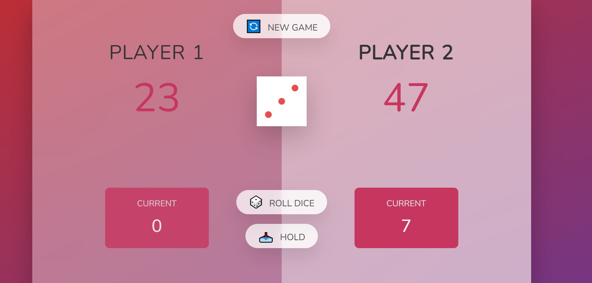
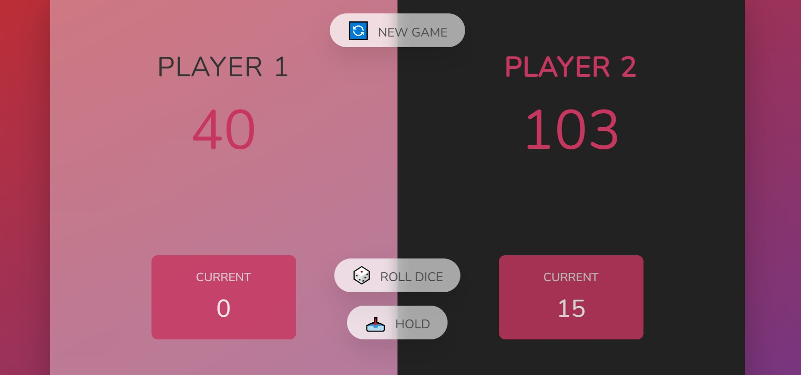

### Roll Dice 🎲

-Two players take turns pressing the "ROLL DICE" button.
-After clicking, dice from 1 to 6 fall out. When 1 player drops -out, he passes the move.
-The task is to collect the maximum number of points and have -time to save them using the "HOLD" button. The game continues -until one of the players scores 100 points

### Example

